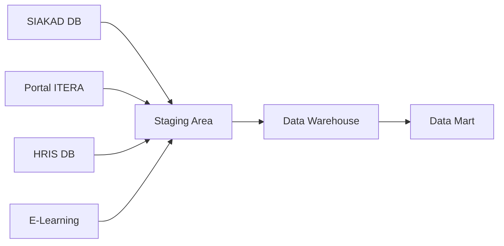

# Data Mart - Institut Teknologi Sumatera (ITERA)
## Tugas Besar Pergudangan Data - Kelompok [X]

---

## 👥 Team Members
- **NIM - Nama (Role)**
- 120450001 - [Nama Anggota 1] (Project Manager)
- 120450002 - [Nama Anggota 2] (Data Analyst)
- 120450003 - [Nama Anggota 3] (Database Designer)

---

## 📋 Project Description

Proyek ini bertujuan untuk merancang dan mengimplementasikan data mart untuk **Platform Satu Data ITERA** - sebuah portal data terpadu yang menyediakan dataset dan insight tentang Institut Teknologi Sumatera. Platform ini memungkinkan pengguna (mahasiswa, dosen, peneliti, dan publik) untuk mencari, mengakses, dan menganalisis berbagai dataset terkait institusi.

Data mart ini akan mendukung:
- **Pencarian Dataset**: Katalog dataset yang terstruktur dan mudah dicari
- **Visualisasi Data**: Dashboard dan grafik interaktif untuk insight cepat
- **Analytics**: Analisis data untuk mendukung riset dan pengambilan keputusan
- **Open Data**: Akses data publik untuk transparansi institusi

**Sumber Data**: [Satu Data ITERA](https://data.itera.ac.id/)

---

## 🎯 Business Domain

**Platform Satu Data ITERA** adalah portal data terpadu Institut Teknologi Sumatera yang menyajikan informasi institusi dalam bentuk:
- **Dataset Publik**: Data yang dapat diakses oleh masyarakat umum
- **Statistik Institusi**: Angka dan visualisasi kinerja ITERA
- **Insight Analytics**: Analisis data untuk mendukung riset dan kebijakan

### Statistik Institusi (Data Aktual dari Portal):
- **23,842 Mahasiswa Aktif**
- **778 Dosen**
- **42 Program Studi**
- **3 Fakultas**

### Kategori Dataset yang Tersedia:
1. **Dataset Akademik**: Data mahasiswa, program studi, performa akademik
2. **Dataset Kepegawaian**: Data dosen, publikasi, penelitian
3. **Dataset Infrastruktur**: Fasilitas kampus, ruang kelas, laboratorium
4. **Dataset Keuangan**: Anggaran, beasiswa, pembiayaan
5. **Dataset Riset**: Publikasi, penelitian, pengabdian masyarakat
6. **Dataset Kemahasiswaan**: Organisasi, prestasi, kegiatan mahasiswa

---

## 🏗️ Architecture

### Approach
- **Data Warehouse Model**: Star Schema
- **Platform**: SQL Server on Azure VM / PostgreSQL
- **ETL Tool**: SSIS / Apache Airflow / Python
- **Visualization**: Power BI / Tableau

### Technology Stack
- Database: SQL Server / PostgreSQL
- ETL: SSIS / Python (Pandas, SQLAlchemy)
- BI Tools: Power BI
- Version Control: Git/GitHub

---

## ✨ Key Features

### Fact Tables
- **Fact_Dataset_Access**: Tracking akses dan download dataset
- **Fact_Dataset_Quality**: Metrik kualitas dataset (completeness, accuracy)
- **Fact_Institution_Metrics**: KPI dan metrik institusi per periode
- **Fact_Search_Query**: Pencarian dataset oleh pengguna

### Dimension Tables
- **Dim_Dataset**: Informasi dataset (nama, kategori, format)
- **Dim_User**: Pengguna portal (mahasiswa, dosen, publik)
- **Dim_Category**: Kategori dataset
- **Dim_Organization**: Unit organisasi ITERA (fakultas, prodi, unit)
- **Dim_Time**: Dimensi waktu (tahun, semester, bulan)
- **Dim_Data_Source**: Sumber data asli

### Key Performance Indicators (KPIs)
- **Dataset Metrics**: Jumlah dataset tersedia, dataset terbaru, update frequency
- **Usage Metrics**: Jumlah pengguna aktif, download count, search queries
- **Quality Metrics**: Data completeness, data accuracy, metadata quality
- **Institution Metrics**: Total mahasiswa, rasio dosen:mahasiswa, publikasi
- **Engagement Metrics**: Active users, popular datasets, trending searches
- **Performance Metrics**: Query response time, system uptime, data freshness

---

## 📁 Documentation

### Business Requirements
📄 [Business Requirements Analysis](docs/01-requirements/business-requirements.md)
📄 [Data Sources Documentation](docs/01-requirements/data-sources.md)

### Design Documents
🎨 [Entity Relationship Diagram (ERD)](docs/02-design/ERD.png)
📊 [Dimensional Model](docs/02-design/dimensional-model.png)
📋 [Data Dictionary](docs/02-design/data-dictionary.xlsx)

### SQL Scripts
💾 [Schema Creation Scripts](sql/schema/)

### Reports & Presentations
📑 [Project Presentations](presentations/)

---

## 📅 Timeline

### Misi 1: Desain Konseptual dan Logikal (1 minggu) ✅
- **Week 1-2**: Business requirements analysis & data source identification
- **Week 2-3**: Conceptual design (ERD)
- **Week 3-4**: Logical design (Dimensional model)

### Misi 2: Implementasi Database (2 minggu)
- **Week 5-6**: Physical database implementation
- **Week 6-7**: ETL process development

### Misi 3: Visualisasi dan Analytics (1 minggu)
- **Week 8**: Dashboard and report development

---

## 📊 Business Requirements Analysis

### 1. Stakeholders

#### Primary Stakeholders
- **Tim Pengelola Portal Satu Data**: Maintenance, update dataset, monitoring sistem
- **Management ITERA**: Menggunakan insight untuk decision making strategis
- **Data Stewards**: Unit-unit yang menyediakan dan memvalidasi dataset
- **Pengguna Eksternal**: Peneliti, masyarakat umum yang mengakses open data

#### Secondary Stakeholders
- **Mahasiswa**: Mencari dataset untuk tugas, skripsi, penelitian
- **Dosen & Peneliti**: Mengakses data untuk riset dan publikasi
- **Bagian Perencanaan & QA**: Analisis data untuk evaluasi institusi
- **Media & Publik**: Akses informasi publik ITERA untuk transparansi

#### Decision Makers
- **Tim Pengelola Portal**: Keputusan terkait dataset prioritas, akses policy
- **Management ITERA**: Keputusan strategis berdasarkan insight data
- **Data Governance Team**: Keputusan terkait data quality, privacy, security

---

### 2. Business Process Analysis

#### Proses Pengelolaan Dataset
```
Data Collection → Data Validation → Metadata Creation → Dataset Publication → Update & Maintenance
```

**KPIs**:
- Jumlah dataset baru dipublikasi per bulan
- Waktu rata-rata dari collection hingga publikasi
- Persentase dataset dengan metadata lengkap
- Frekuensi update dataset sesuai schedule

#### Proses Akses dan Download Dataset
```
User Registration → Search/Browse → Dataset Preview → Download/API Access → Usage Tracking
```

**KPIs**:
- Jumlah user aktif per bulan (by type: mahasiswa, dosen, publik)
- Total akses dan download dataset
- Conversion rate dari search ke download
- Response time rata-rata untuk akses dataset
- Popular datasets (top 10 most accessed)

#### Proses Data Quality Management
```
Quality Assessment → Issue Identification → Data Cleaning → Re-validation → Quality Reporting
```

**KPIs**:
- Data completeness score rata-rata per kategori
- Data accuracy score per dataset
- Persentase dataset dengan quality score > 90%
- Jumlah dataset yang perlu improvement
- Time lag antara data collection dan availability

#### Proses Search & Discovery
```
User Query → Search Execution → Results Ranking → Dataset Selection → Feedback Collection
```

**KPIs**:
- Total pencarian per hari/minggu/bulan
- Search success rate (queries with results)
- Popular search keywords
- Average search duration
- Click-through rate untuk hasil pencarian
- Zero-result search rate (queries tanpa hasil)

---

### 3. Analytical Requirements

#### Business Questions to Answer

**Dataset Management Analytics**:
1. Berapa jumlah dataset tersedia per kategori?
2. Dataset mana yang paling sering diakses/didownload?
3. Bagaimana kualitas dataset yang tersedia (completeness, freshness)?
4. Kategori dataset apa yang paling banyak dicari?

**User Behavior Analytics**:
5. Siapa pengguna aktif portal (mahasiswa, dosen, publik)?
6. Apa keyword pencarian yang paling populer?
7. Kapan waktu peak usage portal?
8. Dataset apa yang trending dalam periode tertentu?

**Institution Metrics Analytics**:
9. Bagaimana tren jumlah mahasiswa, dosen, program studi?
10. Bagaimana performa institusi dari tahun ke tahun?
11. Apa insight utama yang dapat diberikan kepada management?

**Data Quality Analytics**:
12. Berapa persentase dataset yang up-to-date?
13. Dataset mana yang perlu di-refresh?
14. Bagaimana coverage metadata untuk setiap dataset?

#### Report Types
- **Daily**: Monitoring kehadiran, penggunaan fasilitas
- **Weekly**: Laporan aktivitas akademik mingguan
- **Monthly**: Laporan kinerja bulanan per unit
- **Semester**: Laporan akademik per semester
- **Annual**: Laporan tahunan institusi

#### Data Granularity
- **Student Level**: Data individual mahasiswa
- **Course Level**: Per mata kuliah
- **Program Level**: Per program studi
- **Faculty Level**: Per fakultas
- **Institution Level**: Agregat institusi

---

## 📂 Data Source Identification

### 1. Available Data Sources

**Portal Satu Data ITERA** mengintegrasikan data dari berbagai sistem internal ITERA:

| Data Source | Type | Volume | Update Frequency | Quality |
|------------|------|--------|------------------|---------|
| SIAKAD Database | SQL Server | ~100K rows (mahasiswa) | Real-time | High |
| Portal Mahasiswa | PostgreSQL | ~50K rows | Real-time | High |
| HRIS Database | SQL Server | ~1K rows (dosen/staff) | Daily | High |
| Absensi Excel | CSV/Excel | ~10K rows/month | Daily | Medium |
| E-Learning Platform | MySQL | ~200K rows (aktivitas) | Real-time | Medium |
| Library System | PostgreSQL | ~50K rows | Real-time | Medium |
| Financial System | SQL Server | ~20K rows/year | Daily | High |

### 2. Data Source Analysis

#### Portal Satu Data ITERA (Primary Source)
**Platform Architecture**:
- **Frontend**: Web portal untuk pencarian dan visualisasi
- **Backend**: REST API untuk akses programmatic
- **Data Catalog**: Metadata management untuk semua dataset
- **Analytics Engine**: Query dan agregasi data

**Dataset Categories Available**:
- Akademik: Data mahasiswa, program studi, perkuliahan
- Kepegawaian: Data dosen, publikasi, penelitian
- Infrastruktur: Fasilitas, ruangan, aset
- Keuangan: Beasiswa, anggaran
- Riset: Penelitian, pengabdian masyarakat

**Data Volume (from Portal)**:
- Total Records: 23,842 mahasiswa aktif
- Dosen: 778 records
- Program Studi: 42 records
- Fakultas: 3 records

**Data Quality**:
- Completeness: 90% (beberapa dataset memiliki missing values)
- Accuracy: High (data divalidasi oleh unit terkait)
- Freshness: Varies (daily untuk data aktif, monthly untuk historis)

**Update Frequency**:
- Real-time untuk statistik institusi
- Daily batch untuk dataset akademik
- Monthly untuk dataset riset dan publikasi

#### Portal Data ITERA (https://data.itera.ac.id/)
**Available Datasets**:
- Total Mahasiswa Aktif: 23,842
- Total Dosen: 778
- Total Program Studi: 42
- Total Fakultas: 3

**Access Method**:
- Web Portal
- REST API (if available)
- Data Export (CSV/Excel)

### 3. Data Profiling

#### Mahasiswa Data Profile
```
Total Records: 23,842
Attributes: NIM, Nama, Program_Studi, Angkatan, Status, IPK, SKS_Lulus
Null Values: < 2%
Duplicates: None (enforced by PK)
Data Format: Consistent
```

#### Dosen Data Profile
```
Total Records: 778
Attributes: NIDN, Nama, Fakultas, Program_Studi, Jabatan_Akademik, Pendidikan
Null Values: ~5% (pada publikasi)
Duplicates: None
Data Format: Consistent
```

### 4. Data Source Mapping



---

## 🎨 Conceptual Design - Entity Relationship Diagram (ERD)

### Main Entities

**Catatan**: ERD ini dirancang untuk **Data Mart Portal Satu Data ITERA**, bukan sistem transaksional akademik. Entitas merepresentasikan dataset dan metadata yang tersedia di portal.

#### 1. **DATASET** (Dataset Catalog)
**Attributes**:
- `Dataset_ID` (PK): INT - Unique identifier dataset
- `Nama_Dataset`: VARCHAR(200) - Nama dataset
- `Deskripsi`: TEXT - Deskripsi konten dataset
- `Kategori_ID` (FK): INT - Kategori dataset
- `Format`: VARCHAR(50) - CSV/JSON/Excel/API
- `Ukuran_File`: BIGINT - Ukuran dalam bytes
- `Jumlah_Records`: INT - Jumlah baris data
- `Tanggal_Publikasi`: DATE
- `Update_Terakhir`: DATETIME
- `Frekuensi_Update`: VARCHAR(50) - Real-time/Daily/Monthly
- `Tingkat_Akses`: VARCHAR(20) - Public/Internal/Restricted
- `URL_Download`: TEXT
- `Data_Source_ID` (FK): INT

#### 2. **KATEGORI_DATASET** (Dataset Category)
**Attributes**:
- `Kategori_ID` (PK): INT
- `Nama_Kategori`: VARCHAR(100) - Akademik/Kepegawaian/Infrastruktur/dll
- `Deskripsi`: TEXT
- `Icon`: VARCHAR(50)
- `Parent_Kategori_ID` (FK): INT - Untuk hierarki kategori

#### 3. **USER_PORTAL** (Portal User)
**Attributes**:
- `User_ID` (PK): INT
- `Username`: VARCHAR(50)
- `Email`: VARCHAR(100)
- `Tipe_User`: VARCHAR(50) - Mahasiswa/Dosen/Publik/Admin
- `Unit_Organisasi`: VARCHAR(100) - Fakultas/Prodi/Unit
- `Tanggal_Registrasi`: DATE
- `Status`: VARCHAR(20) - Aktif/Non-aktif

#### 4. **AKSES_DATASET** (Dataset Access Log)
**Attributes**:
- `Akses_ID` (PK): INT
- `Dataset_ID` (FK): INT
- `User_ID` (FK): INT
- `Tanggal_Akses`: DATETIME
- `Tipe_Akses`: VARCHAR(50) - View/Download/API_Call
- `Status`: VARCHAR(20) - Success/Failed
- `IP_Address`: VARCHAR(45)

#### 5. **PENCARIAN** (Search Query Log)
**Attributes**:
- `Pencarian_ID` (PK): INT
- `User_ID` (FK): INT
- `Keyword`: VARCHAR(200)
- `Kategori_Filter`: VARCHAR(100)
- `Tanggal_Pencarian`: DATETIME
- `Jumlah_Hasil`: INT
- `Dataset_Dipilih` (FK): INT - Dataset yang diklik

#### 6. **METADATA_KUALITAS** (Data Quality Metadata)
**Attributes**:
- `Kualitas_ID` (PK): INT
- `Dataset_ID` (FK): INT
- `Tanggal_Evaluasi`: DATE
- `Completeness_Score`: DECIMAL(5,2) - Persentase kelengkapan
- `Accuracy_Score`: DECIMAL(5,2)
- `Consistency_Score`: DECIMAL(5,2)
- `Timeliness_Score`: DECIMAL(5,2) - Seberapa fresh data
- `Overall_Score`: DECIMAL(5,2)
- `Catatan`: TEXT

#### 7. **SUMBER_DATA** (Data Source)
**Attributes**:
- `Source_ID` (PK): INT
- `Nama_Source`: VARCHAR(100) - SIAKAD/HRIS/E-Learning/dll
- `Tipe_Source`: VARCHAR(50) - Database/API/File/Manual
- `Connection_String`: TEXT
- `PIC_Source`: VARCHAR(100) - Person in charge
- `Unit_Pemilik`: VARCHAR(100)

#### 8. **INSTITUSI_METRICS** (Institution Metrics)
**Attributes**:
- `Metric_ID` (PK): INT
- `Periode`: DATE - Periode pengukuran
- `Jumlah_Mahasiswa_Aktif`: INT
- `Jumlah_Dosen`: INT
- `Jumlah_Program_Studi`: INT
- `Jumlah_Publikasi`: INT
- `Jumlah_Penelitian`: INT
- `Dataset yang tersedia`: INT

#### 9. **UNIT_ORGANISASI** (Organizational Unit)
**Attributes**:
- `Unit_ID` (PK): INT
- `Kode_Unit`: VARCHAR(10)
- `Nama_Unit`: VARCHAR(100) - Fakultas/Prodi/Unit kerja
- `Tipe_Unit`: VARCHAR(50) - Fakultas/Program_Studi/Direktorat/Lembaga
- `Parent_Unit_ID` (FK): INT - Untuk hierarki organisasi
- `PIC_Data`: VARCHAR(100) - Person in charge untuk data unit
- `Email_Kontak`: VARCHAR(100)

#### 10. **PERIODE_WAKTU** (Time Period)
**Attributes**:
- `Periode_ID` (PK): INT
- `Tahun`: INT
- `Semester`: INT - 1 (Ganjil), 2 (Genap)
- `Tahun_Akademik`: VARCHAR(10) - "2023/2024"
- `Bulan`: INT
- `Kuartal`: INT
- `Tanggal_Mulai`: DATE
- `Tanggal_Selesai`: DATE
- `Is_Active`: BOOLEAN

---

### Supporting Reference Entities (Dataset Content)

**Catatan**: Entitas berikut merepresentasikan konten dalam dataset yang dipublikasikan di portal, bukan struktur portal itu sendiri.

#### **Dataset: Data Mahasiswa**
**Typical Attributes in Dataset**:
- NIM, Nama, Program_Studi, Fakultas, Angkatan, Status, Jenjang

#### **Dataset: Data Dosen**
**Typical Attributes in Dataset**:
- NIDN, Nama, Program_Studi, Fakultas, Jabatan_Akademik, Pendidikan_Terakhir

#### **Dataset: Data Program Studi**
**Typical Attributes in Dataset**:
- Kode_Prodi, Nama_Prodi, Fakultas, Jenjang, Akreditasi, Jumlah_Mahasiswa, Jumlah_Dosen

#### **Dataset: Data Fakultas**
**Typical Attributes in Dataset**:
- Kode_Fakultas, Nama_Fakultas, Jumlah_Prodi, Total_Mahasiswa, Total_Dosen

#### **Dataset: Publikasi & Penelitian**
**Typical Attributes in Dataset**:
- Judul, Penulis, Tahun, Kategori, Journal/Conference, Citation_Count

#### **Dataset: Statistik Institusi**
**Typical Attributes in Dataset**:
- Periode, Jumlah_Mahasiswa_Aktif, Jumlah_Dosen, Rasio_Dosen_Mahasiswa, Jumlah_Lulusan

### Relationships

**Untuk Portal Satu Data (Core Relationships)**:

1. **DATASET - KATEGORI_DATASET** (Many-to-One)
   - Setiap dataset termasuk dalam satu kategori utama
   - Satu kategori dapat memiliki banyak dataset

2. **DATASET - SUMBER_DATA** (Many-to-One)
   - Setiap dataset berasal dari satu sumber data
   - Satu sumber data dapat menghasilkan banyak dataset

3. **USER_PORTAL - AKSES_DATASET** (One-to-Many)
   - Satu user dapat mengakses banyak dataset
   - Setiap akses dilakukan oleh satu user
   - Tracking melalui tabel AKSES_DATASET

4. **DATASET - AKSES_DATASET** (One-to-Many)
   - Satu dataset dapat diakses berkali-kali
   - Setiap akses terkait dengan satu dataset

5. **USER_PORTAL - PENCARIAN** (One-to-Many)
   - Satu user dapat melakukan banyak pencarian
   - Setiap pencarian dilakukan oleh satu user

6. **DATASET - METADATA_KUALITAS** (One-to-Many)
   - Satu dataset dapat memiliki banyak evaluasi kualitas (per periode)
   - Setiap evaluasi terkait dengan satu dataset

7. **PENCARIAN - DATASET** (Many-to-One)
   - Setiap pencarian dapat menghasilkan pemilihan satu dataset
   - Satu dataset dapat dipilih dari banyak pencarian

**Untuk Data Konten (Dimension Data)**:

8. **MAHASISWA - PROGRAM_STUDI** (Many-to-One)
   - Data mahasiswa sebagai konten dataset
   
9. **DOSEN - PROGRAM_STUDI** (Many-to-One)
   - Data dosen sebagai konten dataset
   
10. **PROGRAM_STUDI - FAKULTAS** (Many-to-One)
   - Hierarki organisasi sebagai dimension

### ERD Business Rules

1. **Dataset Publication Rules**:
   - Setiap dataset harus memiliki metadata lengkap sebelum dipublikasi
   - Dataset harus memiliki PIC (Person In Charge) dari unit pemilik data
   - Dataset dengan tingkat akses "Restricted" hanya dapat diakses oleh user yang authorized
   - Dataset harus di-update sesuai frekuensi yang ditentukan

2. **Data Access Rules**:
   - User publik hanya dapat mengakses dataset dengan tingkat akses "Public"
   - User internal (mahasiswa/dosen) dapat mengakses dataset "Public" dan "Internal"
   - Setiap akses dan download dataset harus dilog untuk audit trail
   - User harus registrasi untuk mengakses dataset "Internal"

3. **Data Quality Rules**:
   - Dataset harus dievaluasi kualitasnya minimal setiap 6 bulan
   - Dataset dengan overall quality score < 60% harus di-flag untuk improvement
   - Missing values > 20% harus didokumentasikan di metadata
   - Dataset yang tidak di-update > 1 tahun harus direview untuk archival

4. **Search & Discovery Rules**:
   - Semua pencarian user dilog untuk analytics dan improvement
   - Popular searches dapat trigger pembuatan dataset baru
   - Keyword pencarian harus di-normalize untuk better matching

5. **Data Governance Rules**:
   - Setiap dataset harus comply dengan kebijakan privasi ITERA
   - Data personal harus di-anonymize sebelum publikasi
   - Dataset finansial hanya tersedia untuk authorized users
   - Setiap perubahan dataset harus diversion control

### ERD Diagram

```
┌─────────────┐         ┌──────────────┐         ┌─────────────┐
│  FAKULTAS   │────────<│ PROGRAM_STUDI│>────────│  MAHASISWA  │
│             │  1   M  │              │  1   M  │             │
│ PK:Fak_ID   │         │ PK:Prodi_ID  │         │ PK:NIM      │
│    Nama     │         │    Nama      │         │    Nama     │
│    Dekan    │         │    Jenjang   │         │    Status   │
└─────────────┘         │ FK:Fak_ID    │         │    IPK      │
                        └──────────────┘         │ FK:Prodi_ID │
                              │ 1                └─────────────┘
                              │                         │ M
                              │ M                       │
                        ┌──────────────┐                │
                        │ MATA_KULIAH  │                │
                        │              │                │
                        │ PK:MK_ID     │                │
                        │    Kode_MK   │         ┌──────┴──────┐
                        │    Nama_MK   │    M    │ ENROLLMENT  │
                        │    SKS       │<────────│             │
                        │ FK:Prodi_ID  │         │ PK:Enr_ID   │
                        └──────────────┘         │ FK:NIM      │
                              │ M                │ FK:MK_ID    │
                              │                  │ FK:NIDN     │
                              │                  │ FK:Sem_ID   │
                              │                  └──────┬──────┘
                        ┌──────────────┐                │ 1
                        │    DOSEN     │                │
                        │              │         ┌──────┴──────┐
                        │ PK:NIDN      │    1    │    NILAI    │
                        │    Nama      │>────────│             │
                        │    Jabatan   │         │ PK:Nilai_ID │
                        │ FK:Prodi_ID  │         │ FK:Enr_ID   │
                        └──────────────┘         │    Nilai    │
                                                 │    Grade    │
                                                 └─────────────┘
┌─────────────┐
│  SEMESTER   │
│             │
│ PK:Sem_ID   │
│    Tahun    │
│    Period   │
└─────────────┘
       │ 1
       │
       M
    (ENROLLMENT)
```

**Notation**:
- `─────<>─────`: One-to-Many relationship
- `PK`: Primary Key
- `FK`: Foreign Key
- `1`, `M`: Cardinality (1 = One, M = Many)

---

## 📐 Logical Design - Dimensional Model

### Data Warehouse Architecture: Star Schema

**Fokus**: Data Mart untuk Portal Satu Data ITERA - tracking dataset access, quality, dan institution metrics.

### Fact Tables

#### 1. **Fact_Dataset_Access** (Fact Tabel Utama)
Menyimpan log akses dan download dataset oleh pengguna portal.

**Grain**: One row per dataset access by user

**Measures** (Metrics):
- `Jumlah_Akses`: INT - Count akses (default 1)
- `Jumlah_Download`: INT - Count download (1 if downloaded, 0 if view only)
- `Jumlah_API_Call`: INT - Count API call (1 if via API)
- `Response_Time_MS`: INT - Response time dalam milidetik
- `Download_Size_MB`: DECIMAL(10,2) - Ukuran download
- `Is_Success`: BIT - Status akses (1=success, 0=failed)

**Dimensions** (Foreign Keys):
- `Dataset_SK` (FK) → Dim_Dataset
- `User_SK` (FK) → Dim_User
- `Category_SK` (FK) → Dim_Category
- `Time_SK` (FK) → Dim_Time
- `Source_SK` (FK) → Dim_Data_Source

**Additivity**:
- `Jumlah_Akses`: Additive
- `Jumlah_Download`: Additive
- `Response_Time_MS`: Semi-additive (avg untuk analisis)
- `Download_Size_MB`: Additive

#### 2. **Fact_Dataset_Quality**
Snapshot kualitas dataset per periode evaluasi.

**Grain**: One row per dataset per evaluation period

**Measures**:
- `Completeness_Score`: DECIMAL(5,2) - Persentase kelengkapan (0-100)
- `Accuracy_Score`: DECIMAL(5,2) - Skor akurasi (0-100)
- `Consistency_Score`: DECIMAL(5,2) - Skor konsistensi (0-100)
- `Timeliness_Score`: DECIMAL(5,2) - Skor freshness (0-100)
- `Overall_Quality_Score`: DECIMAL(5,2) - Skor keseluruhan (0-100)
- `Missing_Values_Count`: INT - Jumlah missing values
- `Record_Count`: INT - Jumlah record dalam dataset
- `Days_Since_Update`: INT - Hari sejak update terakhir

**Dimensions**:
- `Dataset_SK` (FK)
- `Category_SK` (FK)
- `Time_SK` (FK)
- `Source_SK` (FK)

#### 3. **Fact_Institution_Metrics**
Metrik dan KPI institusi per periode.

**Grain**: One row per institution per time period

**Measures**:
- `Jumlah_Mahasiswa_Aktif`: INT
- `Jumlah_Dosen`: INT
- `Jumlah_Program_Studi`: INT
- `Jumlah_Fakultas`: INT
- `Jumlah_Publikasi`: INT
- `Jumlah_Penelitian`: INT
- `Rasio_Dosen_Mahasiswa`: DECIMAL(5,2)
- `Jumlah_Lulusan`: INT
- `Dataset_Available_Count`: INT - Jumlah dataset tersedia

**Dimensions**:
- `Organization_SK` (FK) → Dim_Organization
- `Time_SK` (FK)

#### 4. **Fact_Search_Query**
Log pencarian dataset oleh pengguna.

**Grain**: One row per search query

**Measures**:
- `Jumlah_Pencarian`: INT - Count (default 1)
- `Jumlah_Hasil`: INT - Jumlah hasil pencarian
- `Dataset_Clicked_Count`: INT - Jumlah dataset yang diklik
- `Search_Duration_MS`: INT - Durasi pencarian
- `Is_Result_Found`: BIT - Apakah ada hasil

**Dimensions**:
- `User_SK` (FK)
- `Category_SK` (FK) - Kategori filter yang dipilih
- `Time_SK` (FK)
- `Dataset_SK` (FK) - Dataset yang akhirnya dipilih (nullable)

---

### Dimension Tables

#### 1. **Dim_Dataset** (SCD Type 2)
Katalog dataset yang tersedia di portal.

**Attributes**:
- `Dataset_SK` (PK): INT - Surrogate Key
- `Dataset_ID` (Natural Key): VARCHAR(50) - ID unik dataset
- `Nama_Dataset`: VARCHAR(200) - Nama dataset
- `Deskripsi`: TEXT - Deskripsi konten
- `Format`: VARCHAR(50) - CSV/JSON/Excel/API
- `Ukuran_File_MB`: DECIMAL(10,2)
- `Jumlah_Records`: INT
- `Kategori`: VARCHAR(100)
- `Tingkat_Akses`: VARCHAR(20) - Public/Internal/Restricted
- `URL_Download`: TEXT
- `Frekuensi_Update`: VARCHAR(50) - Real-time/Daily/Monthly
- `Tanggal_Publikasi`: DATE
- `Status`: VARCHAR(20) - Active/Archived
- `Effective_Date`: DATE - SCD Type 2
- `End_Date`: DATE - SCD Type 2
- `Is_Current`: BIT - SCD Type 2

**SCD Type 2 Strategy**: Track changes in dataset metadata

#### 2. **Dim_User** (SCD Type 1)
Pengguna portal Satu Data.

**Attributes**:
- `User_SK` (PK): INT
- `User_ID` (Natural Key): VARCHAR(50) - Username/NIM/Email
- `Nama_User`: VARCHAR(100)
- `Email`: VARCHAR(100)
- `Tipe_User`: VARCHAR(50) - Mahasiswa/Dosen/Peneliti/Publik/Admin
- `Unit_Organisasi`: VARCHAR(100) - Fakultas/Prodi/Unit kerja
- `Status`: VARCHAR(20) - Active/Inactive
- `Tanggal_Registrasi`: DATE
- `Total_Dataset_Accessed`: INT - Aggregate counter

**SCD Type 1 Strategy**: Overwrite changes (simple updates)

#### 3. **Dim_Category**
Kategori dataset.

**Attributes**:
- `Category_SK` (PK): INT
- `Category_ID` (Natural Key): VARCHAR(20)
- `Nama_Kategori`: VARCHAR(100) - Akademik/Kepegawaian/Infrastruktur/dll
- `Deskripsi`: TEXT
- `Icon`: VARCHAR(50)
- `Parent_Category_SK` (FK): INT - Hierarki kategori
- `Level`: INT - Level dalam hierarki

**Hierarchy**:
```
Kategori Level 1 → Kategori Level 2 → Kategori Level 3
```

#### 4. **Dim_Organization**
Unit organisasi ITERA.

**Attributes**:
- `Organization_SK` (PK): INT
- `Kode_Unit`: VARCHAR(10)
- `Nama_Unit`: VARCHAR(100)
- `Tipe_Unit`: VARCHAR(50) - Institusi/Fakultas/Program_Studi/Unit
- `Parent_Unit_SK` (FK): INT - Hierarki organisasi
- `Level`: INT
- `PIC_Data`: VARCHAR(100)
- `Email_Kontak`: VARCHAR(100)

**Hierarchy**:
```
Institusi → Fakultas → Program Studi
```

#### 5. **Dim_Data_Source**
Sumber data asli dataset.

**Attributes**:
- `Source_SK` (PK): INT
- `Source_ID` (Natural Key): VARCHAR(20)
- `Nama_Source`: VARCHAR(100) - SIAKAD/HRIS/E-Learning/dll
- `Tipe_Source`: VARCHAR(50) - Database/API/File/Manual
- `Unit_Pemilik`: VARCHAR(100)
- `PIC_Source`: VARCHAR(100)
- `Update_Frequency`: VARCHAR(50)

#### 6. **Dim_Time** (Date Dimension)
Dimensi waktu untuk analisis temporal.

**Attributes**:
- `Time_SK` (PK): INT
- `Date`: DATE
- `Tahun`: INT
- `Semester`: INT - 1 (Ganjil), 2 (Genap)
- `Tahun_Akademik`: VARCHAR(10) - "2023/2024"
- `Bulan`: INT
- `Nama_Bulan`: VARCHAR(20)
- `Kuartal`: INT
- `Minggu_Ke`: INT
- `Hari`: INT
- `Nama_Hari`: VARCHAR(20)
- `Is_Weekend`: BOOLEAN
- `Is_Holiday`: BOOLEAN

**Hierarchy**:
```
Tahun → Semester → Bulan → Minggu → Hari
```

---

### Star Schema Diagram

```
                    ┌──────────────┐
                    │  Dim_Time    │
                    │              │
                    │ PK:Time_SK   │
                    │    Tahun     │
                    │    Semester  │
                    │    Bulan     │
                    └──────┬───────┘
                           │
                           │
    ┌──────────────┐       │       ┌──────────────┐
    │ Dim_Dataset  │       │       │  Dim_User    │
    │              │       │       │              │
    │ PK:Data_SK   │       │       │ PK:User_SK   │
    │    Nama      │       │       │    Tipe      │
    │    Format    │       │       │    Unit      │
    │    Status    │       │       │    Status    │
    └──────┬───────┘       │       └──────┬───────┘
           │               │              │
           │               │              │
           └───────────┐   │   ┌──────────┘
                       │   │   │
                 ┌─────┴───┴───┴──────┐
                 │ Fact_Dataset_Access│
                 │                    │
                 │ FK:Dataset_SK      │
                 │ FK:User_SK         │
                 │ FK:Category_SK     │
                 │ FK:Source_SK       │
                 │ FK:Time_SK         │
                 │                    │
                 │ M:Jumlah_Akses     │
                 │ M:Jumlah_Download  │
                 │ M:Response_Time    │
                 └─────┬───┬───┬──────┘
                       │   │   │
           ┌───────────┘   │   └──────────┐
           │               │              │
    ┌──────┴───────┐       │       ┌──────┴───────┐
    │ Dim_Category │       │       │ Dim_Source   │
    │              │       │       │              │
    │ PK:Cat_SK    │       │       │ PK:Src_SK    │
    │    Nama      │       │       │    Nama      │
    │    Level     │       │       │    Tipe      │
    │    Parent    │       │       │    Unit      │
    └──────────────┘       │       └──────────────┘
                           │
                    ┌──────┴───────┐
                    │ Dim_Org      │
                    │              │
                    │ PK:Org_SK    │
                    │    Nama      │
                    │    Tipe      │
                    └──────────────┘
```

---

### Naming Convention for Surrogate Keys

**Pattern**: `Dim[EntityName]_SK`

**Examples**:
- `DimStudent_SK`
- `DimLecturer_SK`
- `DimCourse_SK`
- `DimProgram_SK`
- `DimTime_SK`

**Surrogate Key Format**: Integer auto-increment starting from 1

---

### SCD (Slowly Changing Dimensions) Strategy

#### Type 1 (Overwrite):
Digunakan untuk perubahan yang tidak perlu di-track historis.
- **Dim_User**: Update profile user (email, unit)
- **Dim_Category**: Update deskripsi kategori
- **Dim_Data_Source**: Update PIC atau kontak

#### Type 2 (Add New Row):
Digunakan untuk perubahan yang perlu di-track historis.
- **Dim_Dataset**: Track perubahan metadata dataset (nama, status, tingkat akses)
- Setiap perubahan metadata penting dicatat sebagai record baru

**Implementation**:
```sql
-- Contoh SCD Type 2 untuk Dim_Dataset
CREATE TABLE Dim_Dataset (
    Dataset_SK INT PRIMARY KEY IDENTITY(1,1),
    Dataset_ID VARCHAR(50) NOT NULL,
    Nama_Dataset VARCHAR(200),
    Status VARCHAR(20),
    Tingkat_Akses VARCHAR(20),
    Effective_Date DATE NOT NULL,
    End_Date DATE,
    Is_Current BIT DEFAULT 1
);
```

---

## 📖 Data Dictionary

### Fact Tables

#### Fact_Dataset_Access

| Column Name | Data Type | PK/FK | Description | Business Rule | Example |
|------------|-----------|-------|-------------|---------------|---------|
| Access_SK | INT | PK | Surrogate key | Auto-increment | 1 |
| Dataset_SK | INT | FK | Reference ke Dim_Dataset | NOT NULL | 1001 |
| User_SK | INT | FK | Reference ke Dim_User | NOT NULL | 2001 |
| Category_SK | INT | FK | Reference ke Dim_Category | NOT NULL | 301 |
| Source_SK | INT | FK | Reference ke Dim_Data_Source | NOT NULL | 101 |
| Time_SK | INT | FK | Reference ke Dim_Time | NOT NULL | 20240101 |
| Jumlah_Akses | INT | Measure | Count akses | Default 1 | 1 |
| Jumlah_Download | INT | Measure | Count download | 0 atau 1 | 1 |
| Jumlah_API_Call | INT | Measure | Count API call | 0 atau 1 | 0 |
| Response_Time_MS | INT | Measure | Response time | > 0 | 250 |
| Download_Size_MB | DECIMAL(10,2) | Measure | Ukuran download | >= 0 | 5.25 |
| Is_Success | BIT | Measure | Status akses | 0=fail, 1=success | 1 |

#### Fact_Dataset_Quality

| Column Name | Data Type | PK/FK | Description | Business Rule | Example |
|------------|-----------|-------|-------------|---------------|---------|
| Quality_SK | INT | PK | Surrogate key | Auto-increment | 1 |
| Dataset_SK | INT | FK | Reference ke Dim_Dataset | NOT NULL | 1001 |
| Category_SK | INT | FK | Reference ke Dim_Category | NOT NULL | 301 |
| Source_SK | INT | FK | Reference ke Dim_Data_Source | NOT NULL | 101 |
| Time_SK | INT | FK | Reference ke Dim_Time | NOT NULL | 20240101 |
| Completeness_Score | DECIMAL(5,2) | Measure | Skor kelengkapan | Range: 0-100 | 95.50 |
| Accuracy_Score | DECIMAL(5,2) | Measure | Skor akurasi | Range: 0-100 | 98.00 |
| Consistency_Score | DECIMAL(5,2) | Measure | Skor konsistensi | Range: 0-100 | 92.75 |
| Timeliness_Score | DECIMAL(5,2) | Measure | Skor freshness | Range: 0-100 | 88.00 |
| Overall_Quality_Score | DECIMAL(5,2) | Measure | Skor keseluruhan | Range: 0-100 | 93.56 |
| Missing_Values_Count | INT | Measure | Jumlah missing values | >= 0 | 45 |
| Record_Count | INT | Measure | Jumlah record | > 0 | 10000 |
| Days_Since_Update | INT | Measure | Hari sejak update | >= 0 | 2 |

#### Fact_Institution_Metrics

| Column Name | Data Type | PK/FK | Description | Business Rule | Example |
|------------|-----------|-------|-------------|---------------|---------|
| Metric_SK | INT | PK | Surrogate key | Auto-increment | 1 |
| Organization_SK | INT | FK | Reference ke Dim_Organization | NOT NULL | 501 |
| Time_SK | INT | FK | Reference ke Dim_Time | NOT NULL | 20240101 |
| Jumlah_Mahasiswa_Aktif | INT | Measure | Count mahasiswa aktif | >= 0 | 23842 |
| Jumlah_Dosen | INT | Measure | Count dosen | >= 0 | 778 |
| Jumlah_Program_Studi | INT | Measure | Count program studi | >= 0 | 42 |
| Rasio_Dosen_Mahasiswa | DECIMAL(5,2) | Measure | Rasio dosen:mahasiswa | > 0 | 30.65 |
| Dataset_Available_Count | INT | Measure | Jumlah dataset tersedia | >= 0 | 125 |

---

### Dimension Tables

#### Dim_Dataset

| Column Name | Data Type | PK/NK | Description | Business Rule | Example |
|------------|-----------|-------|-------------|---------------|---------|
| Dataset_SK | INT | PK | Surrogate key | Auto-increment | 1001 |
| Dataset_ID | VARCHAR(50) | NK | ID unik dataset | Unique, NOT NULL | DS_AKADEMIK_001 |
| Nama_Dataset | VARCHAR(200) | - | Nama dataset | NOT NULL | Data Mahasiswa Aktif 2024 |
| Deskripsi | TEXT | - | Deskripsi konten | - | Dataset berisi informasi mahasiswa aktif |
| Format | VARCHAR(50) | - | Format file | CSV/JSON/Excel/API | CSV |
| Ukuran_File_MB | DECIMAL(10,2) | - | Ukuran file | >= 0 | 5.25 |
| Jumlah_Records | INT | - | Jumlah baris data | > 0 | 23842 |
| Kategori | VARCHAR(100) | - | Nama kategori | NOT NULL | Akademik |
| Tingkat_Akses | VARCHAR(20) | - | Level akses | Public/Internal/Restricted | Public |
| URL_Download | TEXT | - | Link download | - | https://data.itera.ac.id/ds001 |
| Frekuensi_Update | VARCHAR(50) | - | Frekuensi update | Real-time/Daily/Monthly | Daily |
| Status | VARCHAR(20) | - | Status dataset | Active/Archived | Active |
| Effective_Date | DATE | - | Tanggal efektif (SCD2) | NOT NULL | 2024-01-01 |
| End_Date | DATE | - | Tanggal akhir (SCD2) | NULL = current | NULL |
| Is_Current | BIT | - | Flag aktif (SCD2) | 0/1 | 1 |

#### Dim_User

| Column Name | Data Type | PK/NK | Description | Business Rule | Example |
|------------|-----------|-------|-------------|---------------|---------|
| User_SK | INT | PK | Surrogate key | Auto-increment | 2001 |
| User_ID | VARCHAR(50) | NK | Username/NIM/Email | Unique, NOT NULL | user_12045001 |
| Nama_User | VARCHAR(100) | - | Nama lengkap | NOT NULL | Ahmad Rizki |
| Email | VARCHAR(100) | - | Email user | Format email | ahmad@student.itera.ac.id |
| Tipe_User | VARCHAR(50) | - | Tipe pengguna | Mahasiswa/Dosen/Peneliti/Publik | Mahasiswa |
| Unit_Organisasi | VARCHAR(100) | - | Unit/Fakultas/Prodi | - | Teknik Informatika |
| Status | VARCHAR(20) | - | Status user | Active/Inactive | Active |
| Tanggal_Registrasi | DATE | - | Tanggal daftar | NOT NULL | 2024-01-15 |
| Total_Dataset_Accessed | INT | - | Counter akses dataset | >= 0 | 25 |

#### Dim_Category

| Column Name | Data Type | PK/NK | Description | Business Rule | Example |
|------------|-----------|-------|-------------|---------------|---------|
| Category_SK | INT | PK | Surrogate key | Auto-increment | 301 |
| Category_ID | VARCHAR(20) | NK | ID kategori | Unique, NOT NULL | CAT_AKAD |
| Nama_Kategori | VARCHAR(100) | - | Nama kategori | NOT NULL | Akademik |
| Deskripsi | TEXT | - | Deskripsi kategori | - | Dataset terkait akademik |
| Icon | VARCHAR(50) | - | Icon kategori | - | academic-cap |
| Parent_Category_SK | INT | FK | Parent kategori (hierarki) | Nullable | NULL |
| Level | INT | - | Level hierarki | 1/2/3 | 1 |

#### Dim_Organization

| Column Name | Data Type | PK/NK | Description | Business Rule | Example |
|------------|-----------|-------|-------------|---------------|---------|
| Organization_SK | INT | PK | Surrogate key | Auto-increment | 501 |
| Kode_Unit | VARCHAR(10) | NK | Kode unit | Unique, NOT NULL | FT |
| Nama_Unit | VARCHAR(100) | - | Nama unit | NOT NULL | Fakultas Teknik |
| Tipe_Unit | VARCHAR(50) | - | Tipe unit | Institusi/Fakultas/Prodi/Unit | Fakultas |
| Parent_Unit_SK | INT | FK | Parent unit (hierarki) | Nullable | 500 |
| Level | INT | - | Level hierarki | 1/2/3/4 | 2 |
| PIC_Data | VARCHAR(100) | - | Person in charge | - | Dr. John Doe |
| Email_Kontak | VARCHAR(100) | - | Email kontak | Format email | admin.ft@itera.ac.id |

#### Dim_Data_Source

| Column Name | Data Type | PK/NK | Description | Business Rule | Example |
|------------|-----------|-------|-------------|---------------|---------|
| Source_SK | INT | PK | Surrogate key | Auto-increment | 101 |
| Source_ID | VARCHAR(20) | NK | ID source | Unique, NOT NULL | SRC_SIAKAD |
| Nama_Source | VARCHAR(100) | - | Nama sumber data | NOT NULL | SIAKAD Database |
| Tipe_Source | VARCHAR(50) | - | Tipe source | Database/API/File/Manual | Database |
| Unit_Pemilik | VARCHAR(100) | - | Unit pemilik | NOT NULL | Direktorat Akademik |
| PIC_Source | VARCHAR(100) | - | PIC sumber data | - | Tim IT Akademik |
| Update_Frequency | VARCHAR(50) | - | Frekuensi update | Real-time/Daily/Monthly | Real-time |

#### Dim_Time

| Column Name | Data Type | PK | Description | Business Rule | Example |
|------------|-----------|-----|-------------|---------------|---------|
| Time_SK | INT | PK | Surrogate key (format: YYYYMMDD) | NOT NULL | 20240101 |
| Date | DATE | - | Tanggal lengkap | NOT NULL | 2024-01-01 |
| Tahun | INT | - | Tahun | Format: YYYY | 2024 |
| Semester | INT | - | Semester akademik | 1=Ganjil, 2=Genap | 1 |
| Tahun_Akademik | VARCHAR(10) | - | Tahun akademik | Format: YYYY/YYYY | 2023/2024 |
| Bulan | INT | - | Nomor bulan | Range: 1-12 | 1 |
| Nama_Bulan | VARCHAR(20) | - | Nama bulan | - | Januari |
| Kuartal | INT | - | Kuartal | Range: 1-4 | 1 |
| Minggu_Ke | INT | - | Minggu ke-n dalam tahun | Range: 1-53 | 1 |
| Hari | INT | - | Nomor hari dalam bulan | Range: 1-31 | 1 |
| Nama_Hari | VARCHAR(20) | - | Nama hari | Senin-Minggu | Senin |
| Is_Weekend | BIT | - | Flag akhir pekan | 0/1 | 0 |
| Is_Holiday | BIT | - | Flag hari libur | 0/1 | 1 |

---

### Data Type Mapping

| Logical Type | SQL Server | PostgreSQL | MySQL |
|--------------|-----------|------------|-------|
| Integer | INT | INTEGER | INT |
| Big Integer | BIGINT | BIGINT | BIGINT |
| Decimal | DECIMAL(p,s) | NUMERIC(p,s) | DECIMAL(p,s) |
| Text (Short) | VARCHAR(n) | VARCHAR(n) | VARCHAR(n) |
| Text (Long) | TEXT | TEXT | TEXT |
| Date | DATE | DATE | DATE |
| DateTime | DATETIME | TIMESTAMP | DATETIME |
| Boolean | BIT | BOOLEAN | TINYINT(1) |

---

---

## 📊 Sample Queries

### Query 1: Dataset Terpopuler Berdasarkan Jumlah Akses
```sql
SELECT 
    ds.Nama_Dataset,
    c.Nama_Kategori,
    org.Nama_Unit AS Unit_Pemilik,
    SUM(fda.Jumlah_Akses) AS Total_Akses,
    SUM(fda.Jumlah_Download) AS Total_Download,
    AVG(fda.Response_Time_MS) AS Avg_Response_Time
FROM Fact_Dataset_Access fda
JOIN Dim_Dataset ds ON fda.Dataset_SK = ds.Dataset_SK
JOIN Dim_Category c ON fda.Category_SK = c.Category_SK
JOIN Dim_Organization org ON fda.Organization_SK = org.Organization_SK
JOIN Dim_Time t ON fda.Time_SK = t.Time_SK
WHERE t.Tahun = 2024 AND ds.Is_Current = 1
GROUP BY ds.Nama_Dataset, c.Nama_Kategori, org.Nama_Unit
ORDER BY Total_Akses DESC
LIMIT 10;
```

### Query 2: Analisis Pola Pencarian User
```sql
SELECT 
    u.Tipe_User,
    c.Nama_Kategori,
    COUNT(DISTINCT fsq.Search_Query_SK) AS Total_Pencarian,
    AVG(fsq.Search_Duration_Seconds) AS Avg_Search_Duration,
    SUM(CASE WHEN fsq.Has_Result = 1 THEN 1 ELSE 0 END) AS Pencarian_Berhasil,
    CAST(SUM(CASE WHEN fsq.Has_Result = 1 THEN 1 ELSE 0 END) AS FLOAT) / COUNT(*) * 100 AS Success_Rate
FROM Fact_Search_Query fsq
JOIN Dim_User u ON fsq.User_SK = u.User_SK
JOIN Dim_Category c ON fsq.Category_SK = c.Category_SK
JOIN Dim_Time t ON fsq.Time_SK = t.Time_SK
WHERE t.Bulan = 11 AND t.Tahun = 2024
GROUP BY u.Tipe_User, c.Nama_Kategori
ORDER BY Total_Pencarian DESC;
```

### Query 3: Trend Kualitas Dataset per Kategori
```sql
SELECT 
    t.Bulan,
    t.Nama_Bulan,
    c.Nama_Kategori,
    AVG(fdq.Completeness_Score) AS Avg_Completeness,
    AVG(fdq.Accuracy_Score) AS Avg_Accuracy,
    AVG(fdq.Timeliness_Score) AS Avg_Timeliness,
    AVG((fdq.Completeness_Score + fdq.Accuracy_Score + fdq.Timeliness_Score) / 3) AS Overall_Quality_Score,
    COUNT(DISTINCT fdq.Dataset_SK) AS Jumlah_Dataset
FROM Fact_Dataset_Quality fdq
JOIN Dim_Category c ON fdq.Category_SK = c.Category_SK
JOIN Dim_Time t ON fdq.Time_SK = t.Time_SK
WHERE t.Tahun = 2024
GROUP BY t.Bulan, t.Nama_Bulan, c.Nama_Kategori
ORDER BY t.Bulan, Overall_Quality_Score DESC;
```

### Query 4: Performa Institusi dan Engagement Pengguna
```sql
SELECT 
    org.Nama_Unit,
    org.Tipe_Unit,
    fim.Jumlah_Dataset_Aktif,
    fim.Jumlah_User_Aktif,
    fim.Total_Akses_Dataset,
    fim.Total_Download,
    fim.Avg_Quality_Score,
    CASE 
        WHEN fim.Avg_Quality_Score >= 90 THEN 'Excellent'
        WHEN fim.Avg_Quality_Score >= 75 THEN 'Good'
        WHEN fim.Avg_Quality_Score >= 60 THEN 'Fair'
        ELSE 'Need Improvement'
    END AS Quality_Rating
FROM Fact_Institution_Metrics fim
JOIN Dim_Organization org ON fim.Organization_SK = org.Organization_SK
JOIN Dim_Time t ON fim.Time_SK = t.Time_SK
WHERE t.Tanggal = (SELECT MAX(Tanggal) FROM Dim_Time)
ORDER BY fim.Total_Akses_Dataset DESC;
```

---

## 📚 References

1. Kimball, R., & Ross, M. (2013). *The Data Warehouse Toolkit: The Definitive Guide to Dimensional Modeling* (3rd ed.). Wiley.
2. Inmon, W. H. (2005). *Building the Data Warehouse* (4th ed.). Wiley.
3. ITERA Official Website: https://www.itera.ac.id/
4. Satu Data ITERA: https://data.itera.ac.id/

---

## 📞 Contact

**Project Team**: Kelompok 10
**Email**: [email@student.itera.ac.id]
**Repository**: https://github.com/[username]/[repo-name]

---

## 📝 License

This project is part of academic assignment for Data Warehousing course at Institut Teknologi Sumatera.

© 2024 Team [Nama Kelompok]. All rights reserved.

---

**Last Updated**: November 2024
**Version**: 1.0
