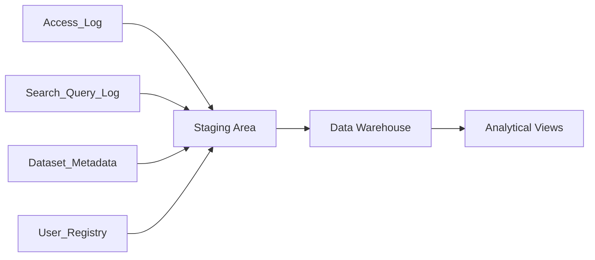

# Data Source Identification
## Data Mart Portal Satu Data ITERA

---

## 1. Available Data Sources

**Portal Satu Data ITERA** mengintegrasikan data operasional portal untuk analitik:

| Data Source | Type | Volume | Update Frequency | Quality | 
|------------|------|--------|------------------|---------|
| SatuData_API | REST API/JSON | ~1K datasets | Real-time | High |
| Access_Log | Server Log | ~50K rows/month | Real-time | High |
| Search_Query_Log | Server Log | ~10K rows/month | Real-time | High |
| Dataset_Metadata | Database | ~700 datasets | Daily | High |
| User_Registry | Database | ~5K users | Daily | High |
| Organization_Master | Master Data | ~50 units | Weekly | High |
| Quality_Assessment | Periodic Report | ~700 records/month | Monthly | Medium |

---

## 3. Data Profiling

### Access_Log Data Profile
```
Dataset Name: Log Akses Dataset Portal
Total Records: ~50,000/month
Attributes: access_id, dataset_id, user_id, timestamp, access_type, 
           file_size, response_time_ms, status
Data Types: INT, BIGINT, DATETIME, VARCHAR
Null Values: < 1% (user_id nullable untuk anonymous)
Duplicates: None (enforced by PK)
Data Format: Consistent
Primary Key: access_id
Foreign Keys: dataset_id (→ Dim_Dataset), user_id (→ Dim_User)
```

**Data Quality Assessment**:
- Completeness: 99%
- Accuracy: 100% (system generated)
- Consistency: 100% (referential integrity enforced)
- Timeliness: Real-time

### Dataset_Metadata Profile
```
Dataset Name: Metadata Dataset Portal
Total Records: ~700 datasets
Attributes: dataset_id, nama_dataset, deskripsi, kategori, format,
           tingkat_akses, tanggal_publikasi, last_update, status
Data Types: INT, VARCHAR, TEXT, DATE
Null Values: ~3% (pada field deskripsi)
Duplicates: None
Data Format: Consistent
Primary Key: dataset_id
```

**Data Quality Assessment**:
- Completeness: 97%
- Accuracy: 98%
- Consistency: 100%
- Timeliness: Daily updates

### User_Registry Profile
```
Dataset Name: Data Pengguna Portal
Total Records: ~5,000 users
Attributes: user_id, username, email, tipe_user,
           unit_organisasi, tanggal_registrasi, status
Data Types: INT, VARCHAR, DATE
Null Values: ~5% (unit_organisasi nullable untuk publik)
Duplicates: None
Data Format: Consistent
Primary Key: user_id
```

**Data Quality Assessment**:
- Completeness: 95%
- Accuracy: 98%
- Consistency: 100%
- Timeliness: Daily updates

### Search_Query_Log Profile
```
Dataset Name: Log Pencarian Portal
Total Records: ~10,000/month
Attributes: search_id, user_id, timestamp, query_text,
           result_count, clicked_dataset_id, search_time_ms
Data Types: INT, TEXT, DATETIME
Null Values: ~10% (user_id nullable untuk anonymous)
Duplicates: None
Data Format: Consistent
Primary Key: search_id
```

**Data Quality Assessment**:
- Completeness: 90%
- Accuracy: 100% (system generated)
- Consistency: 100%
- Timeliness: Real-time

---

## 4. Data Source Mapping



### ETL Process Flow

**Extract**:
- Access_Log → Extract akses dataset (view, download, API call)
- Search_Query_Log → Extract log pencarian user
- Dataset_Metadata → Extract katalog dan metadata dataset
- User_Registry → Extract data pengguna portal

**Transform**:
- Data cleansing (handle nulls for anonymous users)
- Data standardization (format, naming conventions)
- Dimension lookup (map to Dim_Dataset, Dim_User, Dim_Time)
- Measure calculation (aggregations, quality scores)
- SCD Type 2 for Dim_Dataset (track metadata changes)

**Load**:
- Load dimensions (SCD Type 1 for Dim_User, SCD Type 2 for Dim_Dataset)
- Load fact tables (Fact_Dataset_Access, Fact_Dataset_Quality, Fact_Search_Query)
- Aggregate to Fact_Institution_Metrics
- Refresh analytical views

---

## 5. Data Source Technical Details

### Access_Log (Server Log)
- **Type**: Web Server Log
- **Format**: Structured log / JSON
- **Location**: Portal Server
- **Connection**: Log parsing / File import
- **Volume**: ~50,000 rows/month
- **Update Pattern**: Real-time (setiap akses dicatat)

### Search_Query_Log (Server Log)
- **Type**: Application Log
- **Format**: Structured log / JSON
- **Location**: Portal Server
- **Connection**: Log parsing / File import
- **Volume**: ~10,000 rows/month
- **Update Pattern**: Real-time (setiap pencarian dicatat)

### Dataset_Metadata (Database)
- **Database Type**: SQL Server 2019
- **Location**: Docker Container (Azure VM)
- **Connection**: JDBC/ODBC
- **Access**: Read-only via ETL service account
- **Volume**: ~700 datasets
- **Update Pattern**: Daily batch

### User_Registry (Database)
- **Database Type**: SQL Server 2019
- **Location**: Docker Container (Azure VM)
- **Connection**: JDBC/ODBC
- **Access**: Read-only via ETL service account
- **Volume**: ~5,000 users
- **Update Pattern**: Daily batch

### Organization_Master (Master Data)
- **Type**: Reference Data
- **Format**: Static table / CSV
- **Volume**: ~50 units
- **Update Pattern**: Weekly / On-demand

---

## 6. Data Governance & Security

### Data Access Control
- **Role-based Access**: Admin, Analytic, Viewer
- **Dataset Classification**: Public, Internal, Restricted
- **User Authentication**: SSO integration
- **API Security**: API key + rate limiting

### Data Privacy
- **Data Masking**: Sensitive fields masked in exports

### Data Lineage
- **Source Tracking**: Origin system for each dataset
- **Transformation Log**: ETL process documentation
- **Version Control**: Dataset versioning
- **Change History**: Audit trail for all changes

### Data Quality Rules
- **Validation Rules**: Schema validation, business rules
- **Quality Checks**: Automated quality scoring
- **Issue Tracking**: Quality issue logging and resolution

---

## 7. Integration Architecture

### Data Integration Patterns

**Batch Integration**:
- Schedule: Daily at 2 AM (low traffic period)
- Process: Full refresh for small tables, incremental for large tables
- Monitoring: ETL job status, error logs
- Fallback: Manual trigger if automated job fails

**Real-time Integration** (Future):
- Method: Change Data Capture (CDC)
- Latency: < 5 minutes
- Use Cases: Dashboard metrics, alerting
- Technology: Kafka / Azure Event Hub

**API Integration**:
- Method: REST API calls
- Authentication: OAuth 2.0 / API keys
- Rate Limits: 1000 requests/hour
- Caching: Redis for frequently accessed data

---
