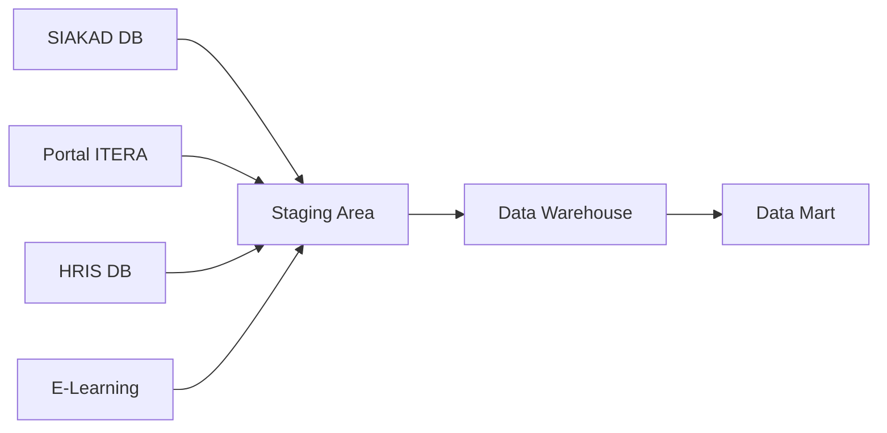

# Data Source Identification
## Data Mart Portal Satu Data ITERA

---

## 1. Available Data Sources

**Portal Satu Data ITERA** mengintegrasikan data dari berbagai sistem internal ITERA:

| Data Source | Type | Volume | Update Frequency | Quality |
|------------|------|--------|------------------|---------|
| SIAKAD Database | SQL Server | ~100K rows (mahasiswa) | Real-time | High |
| Portal Mahasiswa | PostgreSQL | ~50K rows | Real-time | High |
| HRIS Database | SQL Server | ~1K rows (dosen/staff) | Daily | High |
| Absensi Excel | CSV/Excel | ~10K rows/month | Daily | Medium |
| E-Learning Platform | MySQL | ~200K rows (aktivitas) | Real-time | Medium |
| Library System | PostgreSQL | ~50K rows | Real-time | Medium |
| Financial System | SQL Server | ~20K rows/year | Daily | High |

---

## 2. Data Source Analysis

### Portal Satu Data ITERA (Primary Source)

**Platform Architecture**:
- **Frontend**: Web portal untuk pencarian dan visualisasi
- **Backend**: REST API untuk akses programmatic
- **Data Catalog**: Metadata management untuk semua dataset
- **Analytics Engine**: Query dan agregasi data

**Dataset Categories Available**:
- **Akademik**: Data mahasiswa, program studi, perkuliahan
- **Kepegawaian**: Data dosen, publikasi, penelitian
- **Infrastruktur**: Fasilitas, ruangan, aset
- **Keuangan**: Beasiswa, anggaran
- **Riset**: Penelitian, pengabdian masyarakat

**Data Volume (from Portal)**:
- Total Records: 23,842 mahasiswa aktif
- Dosen: 778 records
- Program Studi: 42 records
- Fakultas: 3 records

**Data Quality**:
- **Completeness**: 90% (beberapa dataset memiliki missing values)
- **Accuracy**: High (data divalidasi oleh unit terkait)
- **Freshness**: Varies (daily untuk data aktif, monthly untuk historis)
- **Consistency**: High (enforced by referential integrity)

**Update Frequency**:
- Real-time untuk statistik institusi
- Daily batch untuk dataset akademik
- Monthly untuk dataset riset dan publikasi

### Portal Data ITERA (https://data.itera.ac.id/)

**Available Datasets**:
- Total Mahasiswa Aktif: 23,842
- Total Dosen: 778
- Total Program Studi: 42
- Total Fakultas: 3

**Access Method**:
- Web Portal (UI-based browsing)
- REST API (if available for programmatic access)
- Data Export (CSV/Excel downloads)

**Dataset Characteristics**:
- Format: CSV, JSON, Excel, API endpoints
- Size Range: 100 KB - 50 MB per dataset
- Metadata: Standardized metadata schema
- Documentation: Dataset descriptions, field definitions

---

## 3. Data Profiling

### Mahasiswa Data Profile
```
Dataset Name: Data Mahasiswa Aktif
Total Records: 23,842
Attributes: NIM, Nama, Program_Studi, Angkatan, Status, IPK, SKS_Lulus
Data Types: VARCHAR, INT, DECIMAL
Null Values: < 2%
Duplicates: None (enforced by PK)
Data Format: Consistent
Primary Key: NIM
Foreign Keys: Program_Studi (→ Program_Studi)
```

**Data Quality Assessment**:
- Completeness: 98%
- Accuracy: 99% (validated against SIAKAD)
- Consistency: 100% (referential integrity enforced)
- Timeliness: Daily updates

### Dosen Data Profile
```
Dataset Name: Data Dosen
Total Records: 778
Attributes: NIDN, Nama, Fakultas, Program_Studi, Jabatan_Akademik, Pendidikan
Data Types: VARCHAR, INT
Null Values: ~5% (pada publikasi)
Duplicates: None
Data Format: Consistent
Primary Key: NIDN
Foreign Keys: Program_Studi (→ Program_Studi)
```

**Data Quality Assessment**:
- Completeness: 95%
- Accuracy: 98%
- Consistency: 100%
- Timeliness: Weekly updates

### Program Studi Data Profile
```
Dataset Name: Data Program Studi
Total Records: 42
Attributes: Kode_Prodi, Nama_Prodi, Fakultas, Jenjang, Akreditasi
Data Types: VARCHAR
Null Values: None
Duplicates: None
Primary Key: Kode_Prodi
Foreign Keys: Fakultas (→ Fakultas)
```

**Data Quality Assessment**:
- Completeness: 100%
- Accuracy: 100%
- Consistency: 100%
- Timeliness: Annual updates

---

## 4. Data Source Mapping



### ETL Process Flow

**Extract**:
- SIAKAD DB → Extract mahasiswa, mata kuliah, nilai
- HRIS DB → Extract dosen, jabatan, publikasi
- Portal ITERA → Extract dataset metadata, akses log
- E-Learning → Extract aktivitas pembelajaran

**Transform**:
- Data cleansing (remove duplicates, fix nulls)
- Data standardization (format, naming conventions)
- Data integration (merge from multiple sources)
- Dimension lookup (map to dimension tables)
- Measure calculation (aggregations, KPIs)

**Load**:
- Load dimensions (SCD Type 1 & Type 2)
- Load fact tables (daily batch)
- Update metadata (catalog, lineage)
- Refresh indexes and statistics

---

## 5. Data Source Technical Details

### SIAKAD Database
- **Database Type**: SQL Server 2019
- **Location**: On-premise
- **Connection**: JDBC/ODBC
- **Access**: Read-only via service account
- **Volume**: ~100K rows (students), ~200K rows (grades)
- **Update Pattern**: Real-time (transactional)

### HRIS Database
- **Database Type**: SQL Server 2019
- **Location**: On-premise
- **Connection**: JDBC/ODBC
- **Access**: Read-only via service account
- **Volume**: ~1K rows (employees)
- **Update Pattern**: Daily batch (8 PM)

### Portal Satu Data ITERA
- **Platform**: Custom web portal
- **Backend**: REST API
- **Data Format**: JSON, CSV
- **Access**: API key authentication
- **Volume**: Varies by dataset
- **Update Pattern**: On-demand via portal UI

### E-Learning Platform
- **Platform**: Moodle / Custom LMS
- **Database Type**: MySQL
- **Connection**: Read replica
- **Volume**: ~200K rows (activities)
- **Update Pattern**: Real-time sync

---

## 6. Data Governance & Security

### Data Access Control
- **Role-based Access**: Admin, Data Steward, Viewer
- **Dataset Classification**: Public, Internal, Restricted
- **User Authentication**: SSO integration
- **API Security**: API key + rate limiting

### Data Privacy
- **PII Protection**: Anonymization for public datasets
- **Data Masking**: Sensitive fields masked in exports
- **Consent Management**: User consent for data usage
- **Compliance**: GDPR-like principles (Indonesia data protection)

### Data Lineage
- **Source Tracking**: Origin system for each dataset
- **Transformation Log**: ETL process documentation
- **Version Control**: Dataset versioning
- **Change History**: Audit trail for all changes

### Data Quality Rules
- **Validation Rules**: Schema validation, business rules
- **Quality Checks**: Automated quality scoring
- **Issue Tracking**: Quality issue logging and resolution
- **Data Stewardship**: Assigned owners for each dataset

---

## 7. Integration Architecture

### Data Integration Patterns

**Batch Integration**:
- Schedule: Daily at 2 AM (low traffic period)
- Process: Full refresh for small tables, incremental for large tables
- Monitoring: ETL job status, error logs
- Fallback: Manual trigger if automated job fails

**Real-time Integration** (Future):
- Method: Change Data Capture (CDC)
- Latency: < 5 minutes
- Use Cases: Dashboard metrics, alerting
- Technology: Kafka / Azure Event Hub

**API Integration**:
- Method: REST API calls
- Authentication: OAuth 2.0 / API keys
- Rate Limits: 1000 requests/hour
- Caching: Redis for frequently accessed data

---

**Document Information**:
- **Created**: November 2024
- **Version**: 1.0
- **Project**: Data Mart Portal Satu Data ITERA
- **Course**: Pergudangan Data - Institut Teknologi Sumatera

