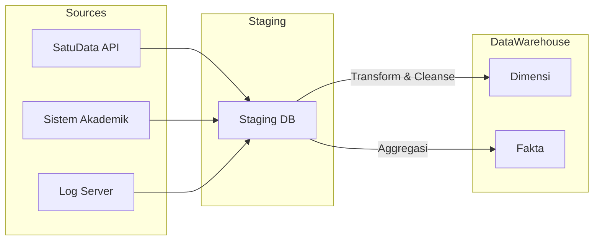

# Dokumentasi ETL - Data Warehouse Satu Data ITERA

## Daftar Isi

1. [Gambaran Umum ETL](#1-gambaran-umum-etl)
2. [Sumber Data](#2-sumber-data)
3. [Arsitektur ETL](#3-arsitektur-etl)
4. [Alur Data](#4-alur-data)
5. [Aturan Transformasi](#5-aturan-transformasi)
6. [Prosedur ETL](#6-prosedur-etl)
7. [Penanganan Error](#7-penanganan-error)
8. [Kualitas Data](#8-kualitas-data)
9. [Monitoring dan Pemeliharaan](#9-monitoring-dan-pemeliharaan)

---

## 1. Gambaran Umum ETL

### 1.1 Tujuan
Proses ETL (Extract, Transform, Load) ini bertanggung jawab untuk mengekstrak data dari sistem sumber Satu Data ITERA, mentransformasikannya sesuai aturan bisnis, dan memuatnya ke dalam data warehouse `DM_SatuDataITERA_DW`. Tujuannya adalah menyediakan data yang bersih, terintegrasi, dan siap analisis untuk kebutuhan pelaporan eksekutif dan operasional.

### 1.2 Jadwal ETL
| Proses | Frekuensi | Jadwal |
|--------|-----------|--------|
| ETL Harian | Senin-Sabtu | 02:00 WIB |
| ETL Mingguan | Minggu | 03:00 WIB | 
| Refresh Penuh | Bulanan | Minggu ke-1, 01:00 WIB |

### 1.3 Komponen ETL

- **Staging Layer:** Penyimpanan sementara untuk data mentah dari sumber.
- **Transformation Layer:** Penerapan logika bisnis, pembersihan data, dan standardisasi.
- **Data Quality Layer:** Validasi aturan bisnis dan integritas data.
- **Loading Layer:** Pemuatan akhir ke tabel Dimensi dan Fakta.

---

## 2. Sumber Data

### 2.1 Sistem Sumber

| Sistem Sumber | Deskripsi | Koneksi | Frekuensi Update |
|---------------|-----------|---------|------------------|
| **SatuData_API** | API utama portal Satu Data | REST API / JSON | Real-time |
| **Sistem_Akademik** | Data mahasiswa dan dosen | Database Link | Harian |
| **Sistem_Kepegawaian** | Data unit kerja dan staf | Database Link | Mingguan |
| **Log_Server** | Log akses dan aktivitas | Flat File / Syslog | Per jam |

### 2.2 Tabel Sumber Utama

- **User/Pengguna:** Data demografis pengguna (Dosen, Mahasiswa, Staf).
- **Dataset:** Metadata dataset yang tersedia di portal.
- **Organisasi:** Struktur unit kerja di ITERA.
- **Access_Logs:** Catatan aktivitas pencarian dan unduhan dataset.

---

## 3. Arsitektur ETL

### 3.1 Diagram Arsitektur

### 3.2 Teknologi

- **Database:** SQL Server 2019 (Linux/Docker)
- **ETL Tool:** T-SQL Stored Procedures & SQL Server Agent
- **Orchestration:** SQL Server Agent Jobs

---

## 4. Alur Data

1. **Persiapan (Pre-ETL):** Truncate tabel staging.
2. **Ekstraksi:** Tarik data dari sumber ke tabel staging (`Staging_User`, `Staging_Dataset`, dll).
3. **Pembersihan:** Hapus spasi berlebih, standarisasi format tanggal, handle NULL values.
4. **Muat Dimensi:**
   - Generate `Dim_Time` (Kalender).
   - Load `Dim_Data_Source` (Data Statis).
   - Update `Dim_User` (SCD Type 1 - Update in place).
   - Update `Dim_Dataset` (SCD Type 2 - History tracking).
   - Update `Dim_Category` dan `Dim_Organization` (Derived from Staging).
5. **Muat Fakta:**
   - Load `Fact_Dataset_Access`, `Fact_Dataset_Quality`, `Fact_Search_Query`.
   - Agregasi data untuk `Fact_Institution_Metrics` (Snapshot Bulanan).
6. **Post-ETL:** Update statistik, hapus staging, kirim notifikasi sukses/gagal.

---

## 5. Aturan Transformasi

### 5.1 Dim_User (SCD Type 1)
- **Logika:** Jika ada perubahan pada Username, Unit Organisasi, atau Status, update record yang ada. Tidak menyimpan histori perubahan profil user.
- **Handling:** Menggunakan `MERGE` statement. Menangani nilai NULL dengan default 'Unknown'.

### 5.2 Dim_Dataset (SCD Type 2)
- **Logika:** Menyimpan histori perubahan metadata dataset (Nama, Deskripsi, Status, Akses).
- **Mekanisme:** 
  - Record lama di-update: `Is_Current = 0`, `End_Date = GETDATE()`.
  - Record baru di-insert: `Is_Current = 1`, `Effective_Date = GETDATE()`, `End_Date = NULL`.

### 5.3 Dim_Organization (Derived)
- **Logika:** Mapping `Tipe_Unit` berdasarkan pola nama unit organisasi.
- **Rules:**
  - 'ITERA' -> 'Pusat'
  - '%Fakultas%' -> 'Fakultas'
  - '%Prodi%' -> 'Prodi'
  - '%Mahasiswa%' -> 'Organisasi Mahasiswa'
  - Dst.

### 5.4 Fact Tables
- **Fact_Dataset_Access:** Mapping ke dimensi menggunakan Surrogate Key (SK). Fallback ke SK -1 ('Unknown') jika dimensi tidak ditemukan.
- **Fact_Institution_Metrics:** Tabel agregasi yang di-truncate dan di-load ulang (Full Refresh) setiap proses ETL untuk performa query dashboard.

---

## 6. Prosedur ETL

### 6.1 Master Procedure
`dbo.usp_Master_ETL`: Mengorkestrasi seluruh proses dalam satu transaksi database.

### 6.2 Dimension Procedures
- `dbo.usp_Populate_Dim_Time`: Generate data dimensi waktu.
- `dbo.usp_Load_Dim_Data_Source`: Inisialisasi sumber data statis.
- `dbo.usp_Load_Dim_User`: Load dimensi user (SCD Type 1).
- `dbo.usp_Load_Dim_Dataset`: Load dimensi dataset (SCD Type 2).
- `dbo.usp_Load_Dim_Category`: Ekstrak kategori unik dari staging dataset.
- `dbo.usp_Load_Dim_Organization`: Ekstrak dan klasifikasi unit organisasi.

### 6.3 Fact Procedures
- `dbo.usp_Load_Fact_Access`: Load fakta akses dataset.
- `dbo.usp_Load_Fact_Quality`: Load fakta kualitas data.
- `dbo.usp_Load_Fact_Search`: Load fakta pencarian.
- `dbo.usp_Load_Fact_Institution_Metrics`: Kalkulasi agregasi metrik institusi.

---

## 7. Penanganan Error

- **Try-Catch Blocks:** Setiap prosedur dibungkus dalam blok Try-Catch.
- **Logging:** Error dicatat ke tabel `ETL_Error_Log` dengan detail waktu, prosedur, dan pesan error.

---

## 8. Kualitas Data

- **Cek Null:** Kolom kunci tidak boleh NULL.
- **Cek Referensi:** Semua Foreign Key di tabel fakta harus ada di tabel dimensi.
- **Cek Duplikasi:** Tidak boleh ada duplikasi pada natural key di tabel dimensi.

---

